# Blendit

<p align="center">
  
</p>

<p align="center"><b>One click in Revit → your 3D view, rendered in Blender.</b><br>
Free, open source, no subscription.</p>

---

## What is it?

If you've ever tried to make a Revit model look good in Blender, you know the drill:
export the geometry, wrestle the import, rebuild every material by hand, place a
camera, light it… and half an hour later it still looks grey. **Blendit skips all of
that.**

Press one button in Revit and your active 3D view turns up in Blender — framed, lit,
materialled, and rendered, with good-looking defaults out of the box. Then you can
walk away with the image, or hop into Blender to fine-tune the shot.

It runs on **Blender** (also free), so there's nothing to subscribe to and nothing
locking your work in.

<p align="center">
  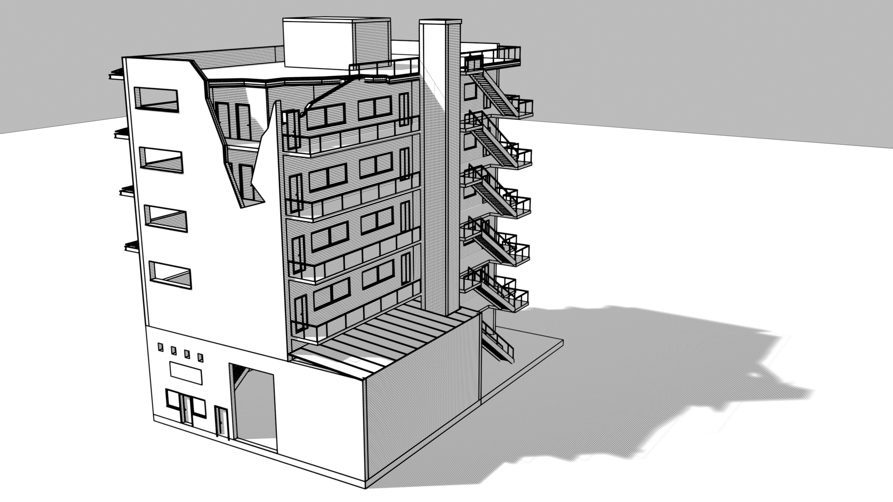
</p>

## What you get

- 🎨 **Sixteen render looks** — photoreal, white-card / clay massing, a sun-accurate
  shadow study, a dark showroom, and a stylised drawing/print family: **linework, pen,
  sketch, cel, hatch, crosshatch, yellowtrace, brown paper, blueprint, diagram,
  watercolor, and risograph**. Pick one on the ribbon (hover for a preview); switch live
  in the review session — or render a **contact sheet** of your shot in all sixteen at once.
- ☁️ **Atmosphere & weather** — procedural **volumetric clouds** and sky: seven cloud
  types (fair-weather cumulus → overcast → towering storm), a live sun / time-of-day,
  and a 360° storm-ring mode. All procedural — no downloads, no huge sky files.
- 📐 **2D drawings** — **load a Revit plan, section or elevation directly** (it comes
  across as a scale-true orthographic drawing, framed to its crop and cut at its view
  range), or pose one in Blender: **plans, elevations and sections** (1:50, 1:100, …)
  sized to real **paper** (A0–A4, Letter, Tabloid) at print DPI, with a section-cut
  slider, solid **poché** cut-fill, and a graphical **scale bar**. Pair them with the
  drawing looks and export as PNG or vector.
- ✏️ **Vector export (SVG / PDF)** — any line style exports as true, editable vector
  paths for Illustrator, Inkscape or CAD — not a pixel image. 2D drawings export
  **to scale on a real paper-sized page** (A2 at 1:50 is A2 at 1:50).
- 🛬 **Compose your shot** — an interactive review session where you fly around, frame
  the view, straighten your verticals (two-point) or switch to orthographic, tweak the
  light, and snap a capture — all without touching Revit again.
- 🔗 **What you see is what you get** — the render matches your Revit view: **linked
  models come through complete** (with their own materials), trees and entourage
  included, and the view's visibility is respected — hidden elements, categories,
  phases and section boxes stay hidden. Real material **textures** come straight
  from Revit's appearance assets at real-world scale, and a model with its own site
  keeps its terrain (no fake ground plane).
- ⚡ **Fast and repeatable** — while you're still in Revit, Blendit prepares the
  scene in the background, so **Open View** typically opens in seconds; the model is
  cached and it's tuned to stay quick even on big, detailed, multi-link models.

## The sixteen looks

Every mode, one click apart (the built-in demo scene — hover any Mode button in
Revit for the same previews):

| | | |
|:---:|:---:|:---:|
| 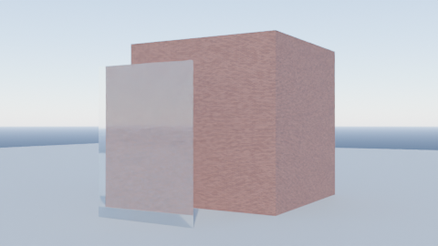 | 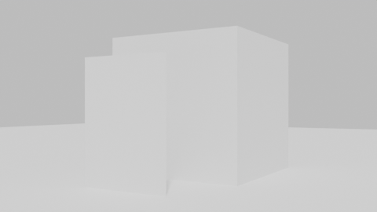 | 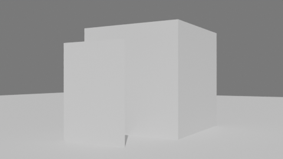 |
| **Realistic** | **White / Clay** | **Shadow study** |
| 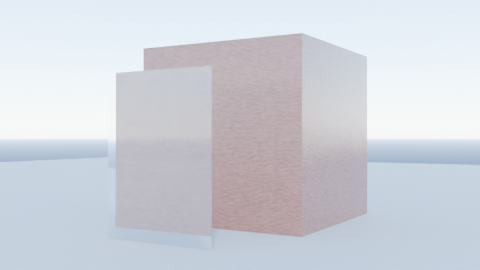 | 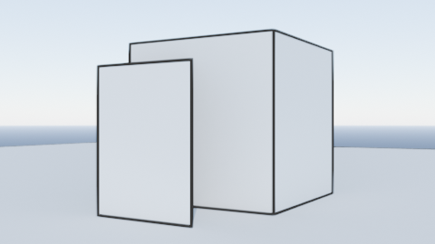 | 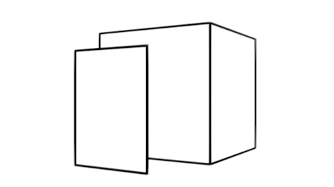 |
| **Specular (showroom)** | **Linework** | **Pen** |
| 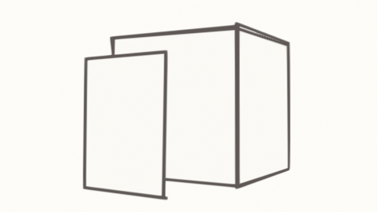 | 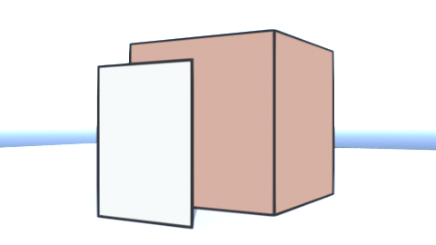 | 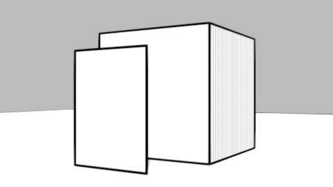 |
| **Sketch** | **Cel / Anime** | **Hatch** |
| 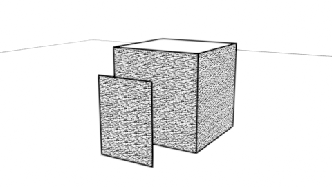 | 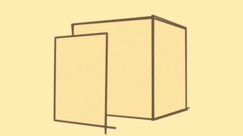 | 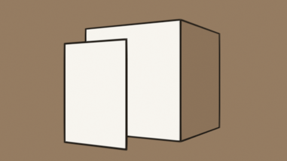 |
| **Crosshatch** | **Yellowtrace** | **Brown Paper** |
| 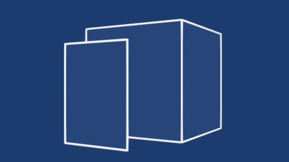 | 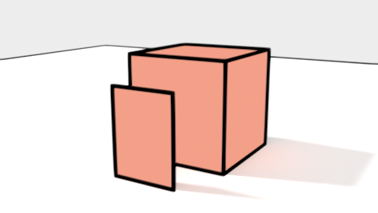 | 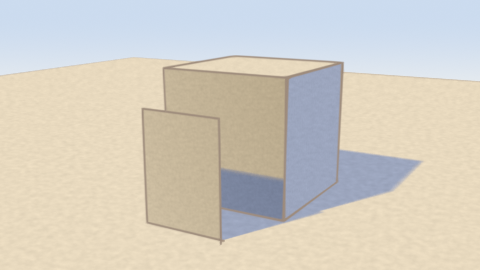 |
| **Blueprint** | **Diagram** | **Watercolor** |
| 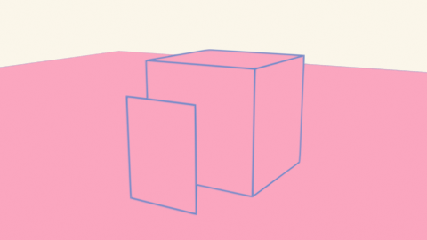 | | |
| **Risograph** | | |

## Requirements

- **Autodesk Revit** with **[pyRevit](https://github.com/pyrevitlabs/pyRevit)**
  installed (Blendit is a pyRevit extension).
- **[Blender](https://www.blender.org/download/) 4.2 or newer** — a free, separate
  download. Blendit points at it; it doesn't run inside Revit.
- **Windows** (for now).

## Install

> One-click install from pyRevit's **Extensions** manager is on the way — the catalog
> listing is [pending review](https://github.com/pyrevitlabs/pyRevit/pull/3463). Until
> it's merged, use the manual steps below (a one-time setup).

1. **Clone the repo** into a folder that ends in `.extension`:
   ```
   git clone https://github.com/lewismconte/blendit.git Blendit.extension
   ```
   *(No git? Download the ZIP from GitHub and unzip it into a folder named
   `Blendit.extension`.)*
2. In Revit, open **pyRevit → Settings → Custom Extension Directories** and add the
   **parent** folder (the one that *contains* `Blendit.extension`), then **Reload**.
3. A **Blendit** tab appears on the Revit ribbon. Done.

First time you render, Blendit will help you point at your `blender.exe` if it can't
find one (or you can set it under **Settings**).

## Using it

From the **Blendit** ribbon:

1. Open a **3D view** — or a **plan / section / elevation** — in Revit.
2. **Load View** — pulls the active view across (the one slow step, with a progress
   bar). Your **composed framing comes with it**: a 3D view keeps its exact camera
   (eye, direction, field of view); a 2D view arrives as a scale-true orthographic
   drawing, cut and framed to match Revit. Load as many views as you like — each
   keeps its own cached copy.
3. Then either:
   - **Open View** — opens it in Blender to fly around, compose, tweak the look, pose
     2D plans / elevations / sections, and capture your shot, or
   - **Render Loaded** — renders it straight to an image, no fuss.
4. **Views** — every loaded view in one list (marked when the model has changed
   since Load): open, render, reload or remove any of them from there.
5. **Open Renders** to find your images.

**Settings** lets you set the Blender path, output folder, default render look, and
quality. That's the whole workflow.

In **Open View**, the **2D Drawings** panel poses an orthographic plan or elevation,
sized to a paper sheet at a chosen scale (or fit-to-sheet), with a section-cut slider;
export it as a PNG, or as SVG / PDF in any of the line looks.

## Where it's going

Blendit works today, and it's built to grow. On the roadmap:

- 🔴 **Live sync** — edit in Revit and watch the Blender view update in real time,
  streaming only what changed.
- 🌳 **Entourage & assets** — a library of procedural trees, people and cars you can
  scatter into a scene (and round-trip back to Revit as lightweight placeholders).
- 🧱 **Richer materials** — real Revit textures ship today; next up: roughness /
  cutout maps, tint colours, and category-aware treatments (mirror, water).
- 🎬 **Animation** — fly-throughs and turntables.
- 🌅 **HDRI skies** and more lighting options.

## Good to know

- **Blender is a separate, free download** — a one-time setup, then Blendit drives it
  for you.
- **Clouds and photoreal renders look best in Cycles.** For faster Cycles renders,
  turn on your GPU once in Blender's **Preferences → System**. The default EEVEE
  engine is realtime either way.
- **Materials come from your Revit model**: Blendit reads each material's appearance
  asset and brings its real **texture maps** (diffuse + bump) across at their
  real-world scale. Anything without a readable texture falls back to a curated
  surface matched on the material name — and you can swap any surface live in the
  review session.
- **Windows only** for now.

## License & credits

**[MIT](LICENSE)** — free to use, free to modify. Blendit drives Blender as a separate
program (it doesn't bundle Blender's code), and ships **no** third-party sky or texture
files, so it stays clean and lightweight.

Built by **[lewismconte](https://github.com/lewismconte)** ·
[portfolio](https://lewismconte.github.io/portfolio). Issues and ideas welcome — if you
put it on a real project, I'd love to hear how it went.

---

## For developers

Blendit is a **bridge**: Revit (IronPython) extracts the active view and writes a small
`.glb` **bundle**; Blender (CPython / `bpy`) imports it and runs a render **pipeline**.
Blender runs as a **separate process**, so nothing heavy loads inside Revit and you keep
full Blender power. The data **contract** between the two sides is the stable seam;
everything else is built on top of it.

- **Deep dive & design rationale:** [CLAUDE.md](CLAUDE.md)
- **The data contract:** [docs/contract.md](docs/contract.md) · **dev loop:**
  [docs/dev-loop.md](docs/dev-loop.md)
- **Hatch & Crosshatch design note:** [hatch TAMs](docs/hatch-tam.md)
- **Parked designs:** [live-sync](docs/live-sync.md) ·
  [live-sync build plan](docs/live-sync-plan.md) · [entourage](docs/entourage.md)

The tests run **headless under `bpy` — no Revit required**. Render the bundled fixture
without any of Revit:

```
python tests/fixtures/build_fixture.py
blender --background --python blender/headless/render.py -- ^
    --bundle tests/fixtures --out out/render.png ^
    [--engine CYCLES|EEVEE] [--mode MODE] [--samples N] ^
    [--camera perspective|orthographic] [--two-point on|off] [--vector svg|pdf]
```

`MODE`: `realistic`, `white`, `shadow`, `specular`, `linework`, `pen`, `sketch`,
`cel`, `hatch`, `crosshatch`, `yellowtrace`, `kraft`, `blueprint`, `diagram`,
`watercolor`, `risograph`. All modes at once: `blender --background --python tests/smoke_render.py`.

Verified on Blender 5.0 / 5.1; Blender 4.2 LTS is the intended floor (API differences
are handled at runtime, but treat 4.2 as best-effort until re-verified).
